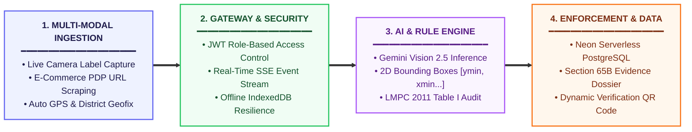
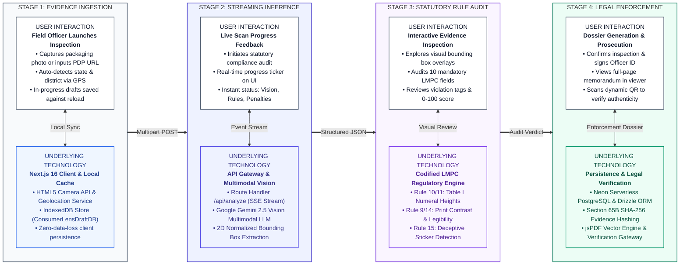
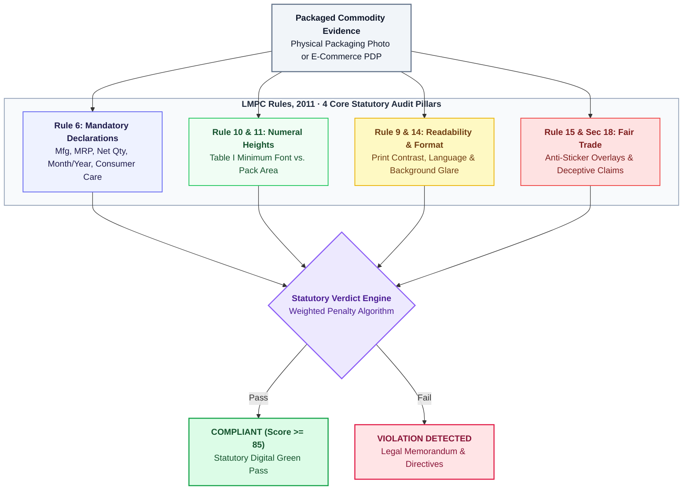
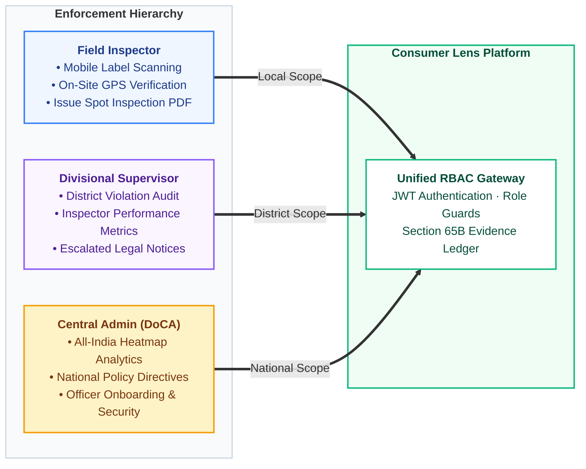
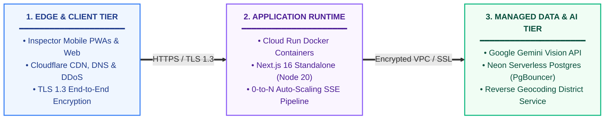
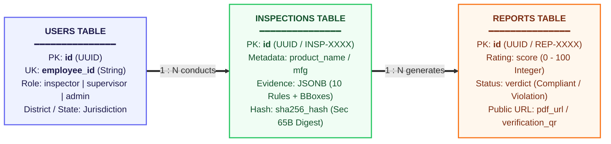

# Consumer Lens — Technical Architecture & Deployment Documentation

**Ministry of Consumer Affairs, Food & Public Distribution**  
**Department of Consumer Affairs (DoCA) · Legal Metrology Division**  
**Problem Statement ID:** 26034 · *Automated Compliance Verification of Packaged Commodities under Legal Metrology (Packaged Commodities) Rules, 2011*

---

## 1. Executive Summary & Objective

**Consumer Lens** is an institutional-grade, AI-powered regulatory enforcement platform engineered for Legal Metrology officers, field inspectors, and supervisory authorities across India. 

The platform automates the inspection of physical packaged commodities and e-commerce product listings to ensure strict adherence to the **Legal Metrology Act, 2009** and the **Legal Metrology (Packaged Commodities) Rules, 2011 (LMPC Rules, 2011)**.

### Key Capabilities
- **Multi-Modal Label Evidence Capture**: Live camera ingestion, high-resolution packaging photo uploads, and automated PDP web scraping for major e-commerce portals (Amazon, Flipkart).
- **Vision AI Multimodal Extraction**: Gemini Vision multimodal inference detecting normalized 2D bounding boxes (`box_2d: [ymin, xmin, ymax, xmax]`), font size compliance, and print readability.
- **Rule 10 & 11 Font Size Compliance**: Evaluates numeral height against packaging net capacity tables, aspect ratio limits, and prominence of MRP.
- **Rule 9 & 14 Packaging Readability & Defect Assessment**: Real-time evaluation of contrast adequacy, glare, blur, and text legibility.
- **Misleading & Deceptive Declaration Flags**: Automatic detection of unauthorized price sticker overlays, contradictory claims, and non-standard pack sizes.
- **Statutory Enforcement Dossier & PDF Memorandum**: Generates courtroom-ready digital inspection dossiers compliant with Section 65B of the Indian Evidence Act, complete with SHA-256 evidence hashes, verification QR codes, and institutional seals.
- **Zero-Data-Loss Offline Resilience**: Client-side IndexedDB persistence ensures field inspectors never lose in-progress scans upon browser reloads or network dropouts.

---

## 2. High-Level System Architecture

The following diagram illustrates the end-to-end architecture of Consumer Lens, connecting the field inspector interface with the application server, AI vision inference engine, relational persistence layer, and external verification infrastructure.



---

## 3. System Design & User Interaction Flow

The following System Design cum User Flow diagram illustrates the exact synchronization between field inspector actions on the client interface and the asynchronous cloud services executing beneath the surface.



### Stage-by-Stage Technical Interaction Matrix

| Stage | Field Inspector Interaction | Technology Components Utilized | Data Processing & Protocol |
| :--- | :--- | :--- | :--- |
| **1. Evidence Ingestion** | Launches PWA on mobile or workstation; triggers live camera stream or inputs e-commerce PDP URL; state/district detected automatically. | HTML5 MediaDevices API, BigDataCloud Geocoding, client-side IndexedDB (`ConsumerLensDraftDB`). | Image serialized into Base64; draft state preserved locally to prevent loss on browser reload. |
| **2. Streaming Inference** | Clicks "Run Compliance Analysis"; views live status ticker advancing through inference milestones. | Next.js Edge / Node Route Handlers (`/api/analyze`), Server-Sent Events (`text/event-stream`), Gemini Vision 2.5 API. | HTTP POST with multipart payload; server dispatches prompt + image to Gemini; streams back real-time step events. |
| **3. Statutory Audit** | Navigates visual label inspector; toggles 2D bounding boxes over packaging; audits missing declarations and penalty scores. | React 19 Canvas/SVG coordinate mapper, LMPC Rule 10/11 Table I height engine, Rule 9/14 contrast scorer. | Maps normalized coordinates `[ymin, xmin, ymax, xmax]` to screen pixels; evaluates declarations against statutory rules; computes 0-100 score. |
| **4. Legal Enforcement** | Confirms findings; saves inspection to state repository; launches full-screen PDF dossier; verifies tamper-proof QR code. | Neon Serverless PostgreSQL, Drizzle ORM, Web Crypto SHA-256 hashing, jsPDF vector engine. | Generates cryptographic hash over inspection parameters; stores record in Postgres; issues Section 65B certified PDF memorandum. |

---

## 4. LMPC Rules, 2011 Regulatory Decision Engine

The regulatory engine evaluates 10 statutory declaration fields against codified legal requirements from the Legal Metrology (Packaged Commodities) Rules, 2011:



### Statutory Severity Matrix

| LMPC Rule Citation | Mandatory Declaration | Defect Condition | Severity Rating | Penalty Deduction |
| :--- | :--- | :--- | :---: | :---: |
| **Rule 6(1)(a)** | Manufacturer / Packer / Importer | Missing name, missing registered address, or no role qualifier | **CRITICAL** | -25 pts |
| **Rule 6(1)(b)** | Generic / Common Name | Brand name only; generic commodity nature omitted | **MAJOR** | -15 pts |
| **Rule 6(1)(c)** | Maximum Retail Price (MRP) | Missing "Inclusive of all taxes", missing currency symbol | **CRITICAL** | -25 pts |
| **Rule 6(1)(d)** | Date of Manufacture / Packing | Missing month and year of packaging | **MAJOR** | -15 pts |
| **Rule 6(1)(e)** | Net Quantity | Non-SI units, missing whitespace around numeral | **CRITICAL** | -25 pts |
| **Rule 6(2)** | Consumer Care Grievance Cell | Missing official phone, email, or physical address | **MAJOR** | -15 pts |
| **Rule 6(11)** | Unit Sale Price (USP) | Missing calculated unit price per gram/ml for packs > 100g/ml | **MINOR** | -10 pts |
| **Rule 9 & 14** | Language & Readability | Low print contrast, glare, blur, or non-English/Hindi declaration | **MINOR** | -10 pts |
| **Rule 10 & 11** | Minimum Font Size (Table I) | Numeral height below statutory minimum for pack area | **MAJOR** | -15 pts |
| **Rule 15 / Sec 18**| Misleading Declarations | Dual pricing stickers, deceptive claims, non-standard pack sizes | **CRITICAL** | -30 pts |

---

## 5. Security & Role-Based Access Control (RBAC) Architecture

Consumer Lens implements institutional role segregation aligned with statutory enforcement hierarchies:



---

## 6. Section 65B Indian Evidence Act Compliance Framework

To ensure that generated inspection reports are legally admissible as electronic evidence in Indian courts of law during prosecution of non-compliant manufacturers, the platform incorporates a statutory digital evidence chain:

1. **SHA-256 Cryptographic Evidence Digest**:
   $$\text{Digest} = \text{SHA-256}(\text{InspectionID} \parallel \text{Date} \parallel \text{Manufacturer} \parallel \text{MRP} \parallel \text{ImageBase64})$$
   This cryptographic hash is stamped into the official dossier reference header. Any tampering with the document or evidence image invalidates the hash.
2. **Dynamic Verification QR Codes**:
   Each generated memorandum contains vector QR codes pointing directly to `https://consumer-lens.vercel.app/inspections/[id]`. Enforcement officers, magistrates, and manufacturers can scan the QR code to verify the report's authenticity against the tamper-proof server record.
3. **Official Seals & Digital Signatures**:
   The report renders proportional vector seals:
   - National Emblem of India (State Emblem)
   - 75 Azadi Ka Amrit Mahotsav Logo
   - Food Safety and Standards Authority of India (FSSAI) Seal
   - Legal Metrology Directorate Official Inspection Stamp
   - Cryptographic vector checkmark and officer employee ID stamp.

---

## 7. Production Deployment & Cloud Framework

Consumer Lens is engineered for zero-downtime multi-cloud deployment with containerized support for Google Cloud Run, AWS ECS, or Vercel Edge.



### Multi-Stage Dockerfile Architecture

The application includes a production-hardened multi-stage Docker build optimized for minimal image footprint and Google Cloud Run execution:

```dockerfile
# Stage 1: Base Image with Node 20 Alpine & Corepack PNPM
FROM node:20-alpine AS base
WORKDIR /app
RUN corepack enable && corepack prepare pnpm@latest --activate

# Stage 2: Dependencies Installation with Cache Mounting
FROM base AS deps
RUN apk add --no-cache libc6-compat
WORKDIR /app
COPY package.json pnpm-lock.yaml* ./
RUN pnpm i --frozen-lockfile

# Stage 3: Builder with Next.js Standalone Optimization
FROM base AS builder
WORKDIR /app
COPY --from=deps /app/node_modules ./node_modules
COPY . .
ENV NEXT_TELEMETRY_DISABLED=1
ENV NODE_ENV=production
RUN pnpm build

# Stage 4: Minimal Runner (Distroless-style Non-Root Execution)
FROM node:20-alpine AS runner
WORKDIR /app
ENV NODE_ENV=production
ENV PORT=8080
ENV HOSTNAME="0.0.0.0"
RUN addgroup --system --gid 1001 nodejs && adduser --system --uid 1001 nextjs
COPY --from=builder /app/public ./public
COPY --from=builder --chown=nextjs:nodejs /app/.next/standalone ./
COPY --from=builder --chown=nextjs:nodejs /app/.next/static ./.next/static
USER nextjs
EXPOSE 8080
CMD ["node", "server.js"]
```

---

## 8. Relational Schema & Entity-Relationship Model



---

## 9. Presentation Cheat-Sheet (Summary for Evaluation & Slides)

| Metric / Dimension | Implementation Detail |
| :--- | :--- |
| **Statutory Law** | Legal Metrology Act, 2009 & Legal Metrology (Packaged Commodities) Rules, 2011 |
| **Target Authority** | Department of Consumer Affairs (DoCA), Ministry of Consumer Affairs, Govt. of India |
| **Front-End Stack** | Next.js 16.3 (App Router), React 19, Tailwind CSS 4, shadcn/ui, Lucide Icons |
| **AI Inference** | Gemini Vision 2.5 Multimodal LLM returning normalized 2D bounding boxes (`box_2d`) |
| **Font Size Rules** | Rule 10 & 11 (Table I minimum numeral height verification against packaging area) |
| **Readability Rules** | Rule 9 & 14 (Automated contrast ratio, blur/glare detection, and print quality scoring) |
| **Deceptive Claims** | Rule 15 & Section 18 (Price sticker overlay detection & contradictory claim flagging) |
| **Offline Resilience** | Native browser IndexedDB (`ConsumerLensDraftDB`) caching images & scan state |
| **Legal Admissibility**| Section 65B Indian Evidence Act SHA-256 evidence digest & dynamic verification QR |
| **Database** | PostgreSQL with Drizzle ORM, connection pooling via Neon serverless |
| **Security** | JWT HTTP-only cookies, bcrypt hashing, role-based route middleware (Inspector/Supervisor/Admin) |
| **Containerization** | Multi-stage Dockerfile running as non-root `nextjs` user on Alpine Node 20 (Port 8080) |

---

*Consumer Lens Technical Architecture Documentation · Department of Consumer Affairs (DoCA) · Legal Metrology Division*
